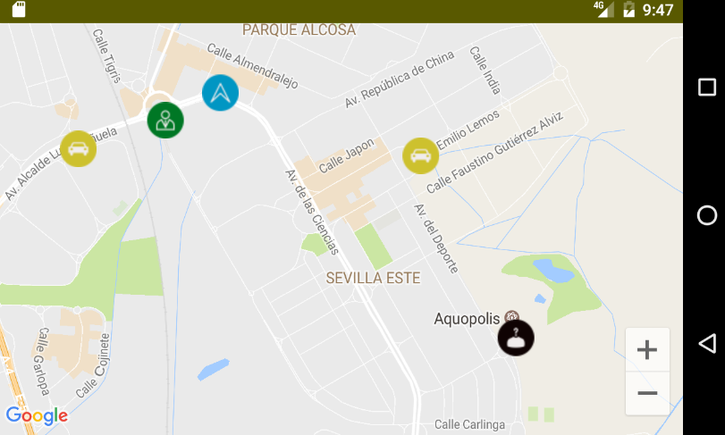
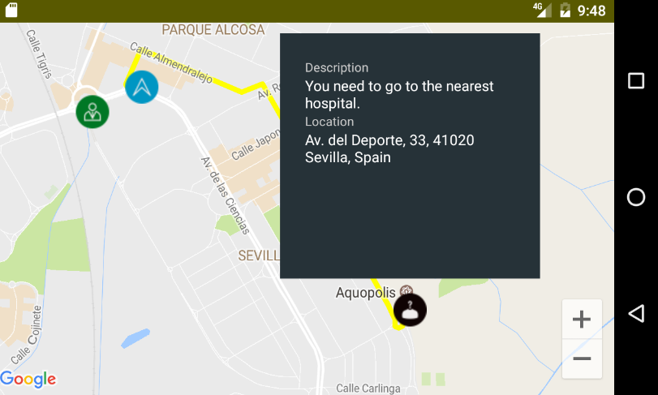

#MYTAXICOMPANY

**MYTAXICOMPANY** is a sample app whose imagined purpose is to serve the mobile workforce of a fictitious taxy company that manage the customers and taxis of a city.

The **objectives** of the demo applications are:

- Explain how to use maps with the **MVVM** pattern.
- How to use **custom pushpins** (images and layouts).
- Advanced pushpins with movement.
- **Popups** with information.
- Drawing **routes**.

## Screens

##Three platforms
The app targets **three** platforms:

* iOS
* Android
* Universal Windows Platform (UWP)
    * UWP supported only in Visual Studio, not Xamarin Studio

## Requirements

* [Visual Studio __2015__](https://www.visualstudio.com/en-us/products/vs-2015-product-editions.aspx) (14.0 or higher) to compile C# 6 langage features (or Visual Studio MacOS)
* Xamarin add-ons for Visual Studio (available via the Visual Studio installer)
* __Visual Studio Community Edition is fully supported!__
* Android SDK Tools 25.2.3 or higher
* JDK 8.0

## Copyright and license
Code released under the [MIT license](https://opensource.org/licenses/MIT).